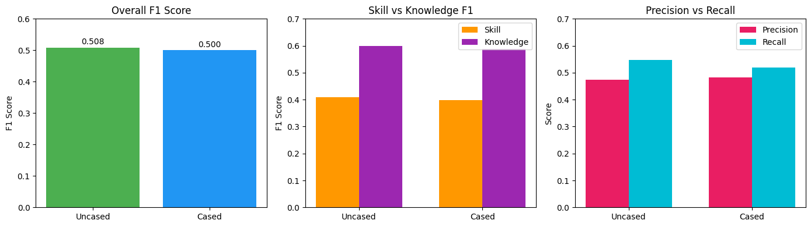
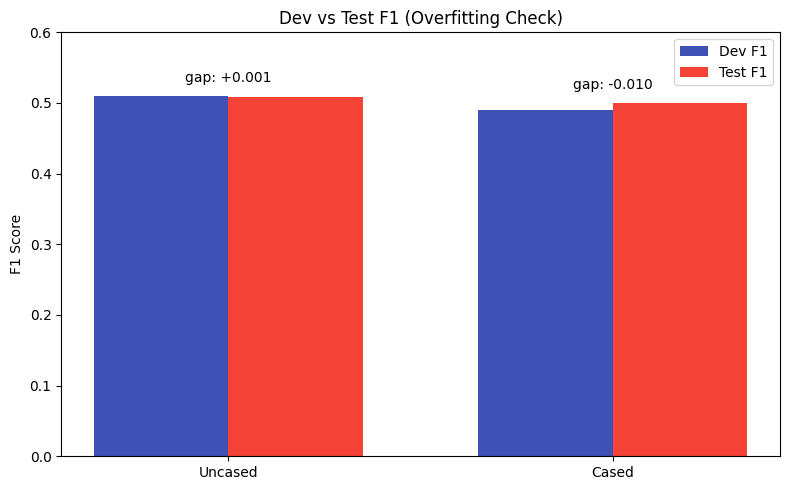
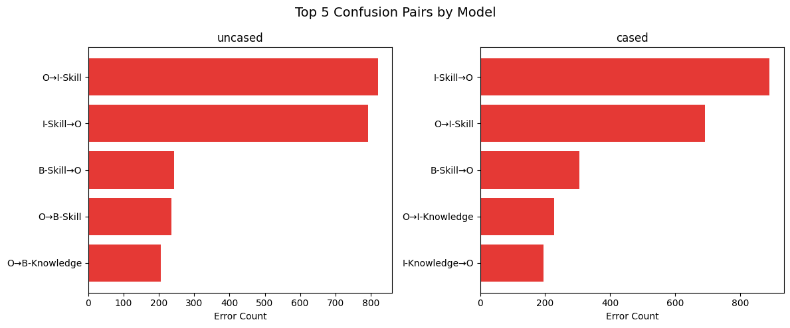

# Model Comparison Analysis
Comparing distilbert-base-uncased vs distilbert-base-cased for NER on SkillSpan dataset

<table border="1" class="dataframe">
  <thead>
    <tr style="text-align: right;">
      <th></th>
      <th>eval_loss</th>
      <th>eval_precision</th>
      <th>eval_recall</th>
      <th>eval_f1</th>
      <th>eval_knowledge_f1</th>
      <th>eval_skill_f1</th>
      <th>eval_skill_precision</th>
      <th>eval_skill_recall</th>
      <th>eval_knowledge_precision</th>
      <th>eval_knowledge_recall</th>
      <th>...</th>
      <th>eval_samples_per_second</th>
      <th>eval_steps_per_second</th>
      <th>epoch</th>
      <th>model</th>
      <th>train_time</th>
      <th>num_params</th>
      <th>avg_inference_latency</th>
      <th>dev_f1</th>
      <th>overfit_gap</th>
      <th>top_confusion</th>
    </tr>
  </thead>
  <tbody>
    <tr>
      <th>0</th>
      <td>0.276139</td>
      <td>0.474191</td>
      <td>0.547598</td>
      <td>0.508258</td>
      <td>0.598270</td>
      <td>0.408696</td>
      <td>0.388751</td>
      <td>0.430797</td>
      <td>0.548666</td>
      <td>0.657736</td>
      <td>...</td>
      <td>292.413</td>
      <td>36.623</td>
      <td>5.0</td>
      <td>distilbert-base-uncased</td>
      <td>756.488262</td>
      <td>66366725</td>
      <td>0.003466</td>
      <td>0.509213</td>
      <td>0.000955</td>
      <td>[(('O', 'I-Skill'), 820), (('I-Skill', 'O'), 7...</td>
    </tr>
    <tr>
      <th>1</th>
      <td>0.308579</td>
      <td>0.481634</td>
      <td>0.519128</td>
      <td>0.499679</td>
      <td>0.588942</td>
      <td>0.397241</td>
      <td>0.398524</td>
      <td>0.395967</td>
      <td>0.548917</td>
      <td>0.635264</td>
      <td>...</td>
      <td>251.477</td>
      <td>31.496</td>
      <td>5.0</td>
      <td>distilbert-base-cased</td>
      <td>878.169684</td>
      <td>65194757</td>
      <td>0.004008</td>
      <td>0.489948</td>
      <td>-0.009731</td>
      <td>[(('I-Skill', 'O'), 891), (('O', 'I-Skill'), 6...</td>
    </tr>
  </tbody>
</table>

2 rows × 21 columns

## Performance Metrics Comparison

<table id="T_bf390">
  <thead>
    <tr>
      <th class="blank level0" >&nbsp;</th>
      <th id="T_bf390_level0_col0" class="col_heading level0 col0" >Metric</th>
      <th id="T_bf390_level0_col1" class="col_heading level0 col1" >Uncased</th>
      <th id="T_bf390_level0_col2" class="col_heading level0 col2" >Cased</th>
      <th id="T_bf390_level0_col3" class="col_heading level0 col3" >Δ</th>
      <th id="T_bf390_level0_col4" class="col_heading level0 col4" >Winner</th>
    </tr>
  </thead>
  <tbody>
    <tr>
      <th id="T_bf390_level0_row0" class="row_heading level0 row0" >0</th>
      <td id="T_bf390_row0_col0" class="data row0 col0" >F1</td>
      <td id="T_bf390_row0_col1" class="data row0 col1" >0.508</td>
      <td id="T_bf390_row0_col2" class="data row0 col2" >0.500</td>
      <td id="T_bf390_row0_col3" class="data row0 col3" >+0.009</td>
      <td id="T_bf390_row0_col4" class="data row0 col4" >uncased</td>
    </tr>
    <tr>
      <th id="T_bf390_level0_row1" class="row_heading level0 row1" >1</th>
      <td id="T_bf390_row1_col0" class="data row1 col0" >Precision</td>
      <td id="T_bf390_row1_col1" class="data row1 col1" >0.474</td>
      <td id="T_bf390_row1_col2" class="data row1 col2" >0.482</td>
      <td id="T_bf390_row1_col3" class="data row1 col3" >-0.007</td>
      <td id="T_bf390_row1_col4" class="data row1 col4" >cased</td>
    </tr>
    <tr>
      <th id="T_bf390_level0_row2" class="row_heading level0 row2" >2</th>
      <td id="T_bf390_row2_col0" class="data row2 col0" >Recall</td>
      <td id="T_bf390_row2_col1" class="data row2 col1" >0.548</td>
      <td id="T_bf390_row2_col2" class="data row2 col2" >0.519</td>
      <td id="T_bf390_row2_col3" class="data row2 col3" >+0.028</td>
      <td id="T_bf390_row2_col4" class="data row2 col4" >uncased</td>
    </tr>
    <tr>
      <th id="T_bf390_level0_row3" class="row_heading level0 row3" >3</th>
      <td id="T_bf390_row3_col0" class="data row3 col0" >Skill F1</td>
      <td id="T_bf390_row3_col1" class="data row3 col1" >0.409</td>
      <td id="T_bf390_row3_col2" class="data row3 col2" >0.397</td>
      <td id="T_bf390_row3_col3" class="data row3 col3" >+0.011</td>
      <td id="T_bf390_row3_col4" class="data row3 col4" >uncased</td>
    </tr>
    <tr>
      <th id="T_bf390_level0_row4" class="row_heading level0 row4" >4</th>
      <td id="T_bf390_row4_col0" class="data row4 col0" >Knowledge F1</td>
      <td id="T_bf390_row4_col1" class="data row4 col1" >0.598</td>
      <td id="T_bf390_row4_col2" class="data row4 col2" >0.589</td>
      <td id="T_bf390_row4_col3" class="data row4 col3" >+0.009</td>
      <td id="T_bf390_row4_col4" class="data row4 col4" >uncased</td>
    </tr>
  </tbody>
</table>

## Performance Visualization

    

    

## Efficiency Metrics

<table id="T_79a9b">
  <thead>
    <tr>
      <th class="blank level0" >&nbsp;</th>
      <th id="T_79a9b_level0_col0" class="col_heading level0 col0" >Model</th>
      <th id="T_79a9b_level0_col1" class="col_heading level0 col1" >Parameters (M)</th>
      <th id="T_79a9b_level0_col2" class="col_heading level0 col2" >Train Time (min)</th>
      <th id="T_79a9b_level0_col3" class="col_heading level0 col3" >Inference Latency (ms)</th>
    </tr>
  </thead>
  <tbody>
    <tr>
      <th id="T_79a9b_level0_row0" class="row_heading level0 row0" >0</th>
      <td id="T_79a9b_row0_col0" class="data row0 col0" >uncased</td>
      <td id="T_79a9b_row0_col1" class="data row0 col1" >66.4</td>
      <td id="T_79a9b_row0_col2" class="data row0 col2" >12.6</td>
      <td id="T_79a9b_row0_col3" class="data row0 col3" >3.47</td>
    </tr>
    <tr>
      <th id="T_79a9b_level0_row1" class="row_heading level0 row1" >1</th>
      <td id="T_79a9b_row1_col0" class="data row1 col0" >cased</td>
      <td id="T_79a9b_row1_col1" class="data row1 col1" >65.2</td>
      <td id="T_79a9b_row1_col2" class="data row1 col2" >14.6</td>
      <td id="T_79a9b_row1_col3" class="data row1 col3" >4.01</td>
    </tr>
  </tbody>
</table>

## Overfitting Analysis

    

    

    ✓ Both models show minimal overfitting (gap < 0.02)

## Error Analysis

    Top Confusion Pairs (True Label → Predicted Label)
    ============================================================
    
    distilbert-base-uncased:
      O               → I-Skill         :  820 errors
      I-Skill         → O               :  793 errors
      B-Skill         → O               :  243 errors
      O               → B-Skill         :  235 errors
      O               → B-Knowledge     :  206 errors
    
    distilbert-base-cased:
      I-Skill         → O               :  891 errors
      O               → I-Skill         :  692 errors
      B-Skill         → O               :  306 errors
      O               → I-Knowledge     :  227 errors
      I-Knowledge     → O               :  195 errors

    

    

## Sample Predictions

    Sample Predictions (distilbert-base-uncased)
    ======================================================================
    
    Tokens: Full Stack Software Engineer - Java / JavaScript
    Token                True            Pred            Match
    -------------------------------------------------------
    Full                 O               O               ✓
    Stack                O               O               ✓
    Software             O               O               ✓
    Engineer             O               O               ✓
    -                    O               O               ✓
    Java                 O               O               ✓
    /                    O               O               ✓
    JavaScript           O               B-Knowledge     ✗
    
    Tokens: javascript reactjs java
    Token                True            Pred            Match
    -------------------------------------------------------
    javascript           B-Knowledge     B-Knowledge     ✓
    reactjs              B-Knowledge     B-Knowledge     ✓
    java                 B-Knowledge     B-Knowledge     ✓
    
    Tokens: javascript reactjs java
    Token                True            Pred            Match
    -------------------------------------------------------
    javascript           B-Knowledge     B-Knowledge     ✓
    reactjs              B-Knowledge     B-Knowledge     ✓
    java                 B-Knowledge     B-Knowledge     ✓

## Summary

    
    KEY FINDINGS
    ============
    
    1. PERFORMANCE:
       • distilbert-base-uncased wins with F1 0.508 vs 0.500
       • Uncased has better recall (+2.8%), cased has slightly better precision
    
    2. SKILL vs KNOWLEDGE:
       • Knowledge entities are easier to detect (F1 ~0.59) than Skills (F1 ~0.40)
       • Knowledge: often single distinctive tokens ("python", "javascript", "aws")
       • Skills: often multi-word phrases ("problem solving", "attention to detail")
    
    3. ERROR PATTERNS:
       • Main error: confusing I-Skill ↔ O (missing continuations)
       • Cased model misses more skill tokens (891 vs 793 I-Skill→O errors)
    
    4. EFFICIENCY:
       • Both models are similar size (~66M params)
       • Uncased is slightly faster to train and at inference
    
    5. OVERFITTING:
       • Neither model shows overfitting (dev-test gap < 0.02)
    
    RECOMMENDATION: Use distilbert-base-uncased for skill/knowledge extraction.
    

